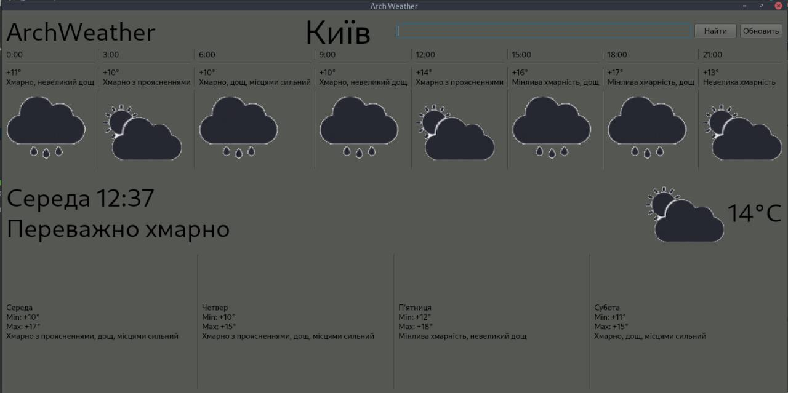

# weatherapp  

### How to run:
  - #### GNU/Linux / MacOS
  ```
  $ git clone https://github.com/wester21/weatherapp
  $ cd weatherapp/dist/main/
  $ ./main
  ```
  ##### or
  ```
  $ git clone https://github.com/wester21/weatherapp
  $ cd weatherapp/
  $ pip install -r requirements.txt
  $ python main.py
  ```  
  - #### Windows
  install Linux and go back to the point above
  
### Last screen


